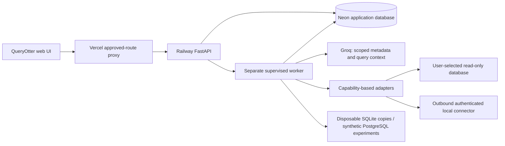

# QueryOtter

[Live application](https://queryotter.vercel.app) · [Repository](https://github.com/wauul/queryotter) · [Field guide](https://queryotter.vercel.app/#docs) · [Support matrix](https://queryotter.vercel.app/#matrix)

QueryOtter connects a read-only database, generates a native query from a question and actual metadata, and helps investigate performance using inspectable evidence. Generation presents a draft for review; **only Run executes it**. Syntax, executability and business meaning are separate claims.

The expanded application runs on **Vercel + Railway + Neon**, with real Groq workflows. Railway deployment was explicitly approved on the existing metered Hobby workspace. The API/worker is online; it does not depend on a desktop tunnel. Neon holds durable accounts, workspaces, encrypted connections/results and jobs. Database credentials and record values never enter model context.

## Features and verification

- Personal workspaces, first-run onboarding, revocable sessions, logout and account deletion.
- GitHub, Google and Microsoft personal-account OAuth login are verified in the deployed browser. Microsoft organization consent can require a verified publisher or tenant-admin approval. Actual status is recorded in public/auth-verification.json.
- Provider selection, pasted URL parsing, guided forms, verified TLS/custom CA, test/discovery, secret masking/rotation/removal, SQLite uploaded copies and an authenticated outbound local connector.
- Schema explorer with actual relationships/index metadata, five-minute cache and explicit refresh. Optional Prisma import supplies context reconciled against the actual database.
- Schema-grounded Groq generation, clarification/refinement, native editor, parser validation, parameterized literal values, explicit Run, 500-row/2 MB snapshots, pagination and JSON/CSV exports.
- Real plans where supported, bounded ranked recommendations, disposable SQLite copy benchmarks, and the preserved seeded PostgreSQL benchmark portfolio.
- Saved queries, private history, retention settings, account export, budgets/usage, responsive states, field guide/FAQ/support, product-specific privacy and terms.

Nine engines passed connection, discovery, native validation and bounded execution against official local services or Firebase emulators. Real Groq evaluation passed **9/9 independently specified engine cases and 3/3 clarification cases**. PostgreSQL also passed against Neon. These are narrow regression fixtures, **not a general accuracy guarantee or hosted verification of every provider**. Remote Turso/libSQL is implemented but has no successful transport/provider verification yet.

The Python suite has **76 passing tests** and the Vercel proxy has **4**. Separate engine integration and actual in-flight timeout fixtures provide additional evidence. See [evaluation methodology](docs/evaluation.md), [support matrix](docs/support-matrix.md) and the public JSON artifacts. All unsupported features remain explicit.

[Deployed UI verification](public/deployed-ui-verification.json) covers all three personal-account sign-in flows, connection rotation/discovery, real generation/refinement, explicit execution, pagination, saved queries/history, cancellation, exports, controlled benchmarks and approved disposable-account deletion. The fresh hosted PostgreSQL report measured 6.294 ms versus 0.086 ms (73.19×) on the synthetic fixture with all four correctness checks passing; copy reports also preserve a separate no-gain outcome. See the actual reports and their methodology before interpreting either measurement.

## Interface and theme

The Riverbench redesign keeps the original QueryOtter mascot unchanged. Cool pearl and river-ink surfaces, self-hosted IBM Plex fonts, ruled evidence rows and explicit review/run actions carry the identity across the landing page, assistant, connections, settings, documentation and PostgreSQL experiments. [DESIGN.md](DESIGN.md) records the implemented system and the three directions considered; [PRODUCT.md](PRODUCT.md) records product constraints.

The native Color theme selector offers System, Light and Dark. System follows the device preference; an explicit choice persists in local browser storage. A blocking same-origin script resolves it before React renders, without changing the script CSP. Reduced motion removes transitions and loading rotations. On smaller screens, schema fields expand above the query; wide tables and code scroll inside their own surfaces.

[Redesign verification](docs/redesign-verification.md) records browser coverage, contrast, real workflows and limits. CI runs eight theme-initialization checks alongside the existing proxy and backend suites.

## Run locally

Requires Node 22+, Python 3.12+ and [uv](https://docs.astral.sh/uv/). Docker is used for optional multi-engine fixtures.

```powershell
npm ci
uv sync --locked
npm run postgres
```

Keep PostgreSQL running on 127.0.0.1:55432. The script creates ignored .env application secrets and a disposable experiment database. Configure MODEL_API_KEY with a Groq key; the default endpoint is https://api.groq.com/openai/v1 and model is openai/gpt-oss-120b. No credential is shipped in the repository or browser bundle. [The environment example](.env.example) includes all server and OAuth variables.

In three other terminals:

```powershell
uv run uvicorn backend.api:app --host 127.0.0.1 --port 8000 --no-access-log
uv run python -m backend.worker
npm run dev
```

Open http://127.0.0.1:5173. The Vite proxy supplies the service token server-side. With JOB_DATABASE_URL unset, the application store is local SQLite. The public demo creates a synthetic SQLite copy, with eight customers and deliberately varied orders; it needs no database credential. backend/demo.py is the reproducible data source.

OAuth development callbacks must be explicitly registered for the chosen local origin. The prepared GitHub application also allows http://127.0.0.1:5175/api/assistant/auth/github/callback for this development session. Set QOT_DEV_API_URL and QOT_DEV_ORIGIN only when deliberately changing Vite's backend/origin. APP_ORIGIN must match the production HTTPS frontend in cloud mode. ADMIN_PASSWORD provides operator access, explicitly distinct from OAuth.

```powershell
uv run pytest -q
npm run test:proxy
npm run test:theme
npm run build:web
docker compose -p qot-adapters -f integration/compose.yml up -d --build
uv run python integration/verify.py --output artifacts/local-adapters.json
uv run python integration/verify_boundaries.py --output artifacts/timeouts.json
```

Create the artifacts directory first. Integration fixtures provision only the named disposable loopback services; their published passwords are test-only. SQL Server uses its Developer edition for non-production tests; Cockroach's fixture is explicitly insecure and does not verify hosted authentication. Firebase uses the official emulators and demo-queryotter namespace. The cloud entrypoint refuses QOT_TEST_NETWORKS.

Actual model evaluations consume model quota:

```powershell
uv run python integration/evaluate_nl.py --pause 15 --output artifacts/nl-evaluation.json
```

They use seeded synthetic databases and independent expected results. Keep production workers and other benchmarks idle for comparable measurements. Free Groq rate limits can still reject a run; failures are recorded rather than replaced with fake queries.

## Architecture and safety

React/TypeScript/Vite is hosted by Vercel. Its Node proxy forwards only approved routes to FastAPI with a private service token. FastAPI commits durable jobs and returns; backend.cloud supervises a **separate** on-demand Python worker in the Railway container. The worker drains the Neon queue with concurrency one and closes database connections while idle.



Every connection, job, result, query and connector operation checks workspace ownership. The worker rechecks account/connection authorization and configuration revision after long operations. Sessions and connector tokens are stored as hashes. Stored credentials, cached metadata, connector tasks and result snapshots use Fernet; the encryption key lives in server configuration separately from application data.

Public connections require certificate and hostname verification and public network addresses. DNS resolutions are rechecked, cloud metadata/private infrastructure is blocked, and private access uses an explicitly scoped connector. Database permissions, transaction controls, parser/native allowlists, deadlines, row/byte limits and concurrency limits work together. No production index is created automatically.

Metadata/query text is untrusted model input. The model sees scoped schema names/types/relationships/indexes and query/plan context. Optional document inference reads at most 20 records per collection in the adapter to infer names/types; values are not sent to Groq. Prompts and query literals can still be sensitive: review them before submission.

Results expire after 15 minutes; pages use one encrypted snapshot. History retention is selectable from 1–90 days. Request-driven maintenance runs at most hourly; expired snapshots are inaccessible immediately. Removing a connection deletes its related application data. Account deletion revokes sessions/connectors and removes active account/workspace data. Provider backups and exported copies follow their own retention. [Privacy](https://queryotter.vercel.app/#privacy) and [terms](https://queryotter.vercel.app/#terms) describe these boundaries.

## Query and optimization examples

“Show the five customers with the highest total paid orders last month. Paid means status = 'paid'; use UTC calendar months and break ties by customer id.”

Select a connection and discover actual metadata. Generate resolves the selected engine/version, presents date boundaries and assumptions, validates the native draft and waits for Run. “Now return the top three” refines the prior query on the same connection. “Show our best customers” should ask what “best” means instead of inventing a metric.

MongoDB receives bounded find/aggregation JSON. Firestore receives its native structured query; Realtime Database receives one native ordering/filter representation. Unsupported joins/aggregations and uncertain inferred document fields are surfaced. See [engine examples and limits](docs/adapter-architecture.md).

Connected engines provide non-executing plans when available and observed Run latency. Model candidates are unmeasured suggestions. SQLite benchmarks create a second disposable copy, compare full typed results including duplicates/NULLs/ordering and output names, then measure seven warm samples with median/MAD and index storage tradeoffs. The original PostgreSQL portfolio retains its independent edge fixtures, four empirical correctness scopes, real EXPLAIN ANALYZE and conservative measured-win threshold. See [methodology and actual results](docs/evaluation.md) and [the historical PostgreSQL implementation](docs/legacy-postgresql.md).

## Deployment and operations

- Frontend: https://queryotter.vercel.app, Vercel Hobby, project queryotter in wauuls-projects.
- API/worker: https://api-worker-production-7d0a.up.railway.app, Railway project queryotter, Amsterdam, one sleeping replica capped at 0.5 CPU / 512 MiB. Metered usage was approved; resource limits are not a dollar cap.
- Durable database: Neon project queryotter (quiet-rice-58196279), production branch br-misty-truth-b1lldsfk, **AWS Frankfurt, eu-central-1**. queryotter_app stores application data in qot_app; queryotter_experiments holds disposable/synthetic experiments.
- Separate restricted application and experiment runtime roles cannot connect to each other's database. qot_live_reader has SELECT-only access to synthetic fixtures. Credentials remain private.
- Model: Groq openai/gpt-oss-120b. The configured development key expires October 30, 2026 and must be renewed server-side.

[Operations and deployment instructions](docs/operations.md) cover secrets, OAuth callbacks, migration, rollback, cold starts, retention and recovery. [Provider-specific guides](docs/provider-guides.md) distinguish providers from engines. [Local connector installation](docs/local-connector.md) covers private networks.

## Limits and external dependencies

Hosted verification is presently Neon PostgreSQL plus the deployed SQLite-copy workflows; other engines were verified locally/emulated. Their provider presets require the user's appropriate credentials and allowed network route. Remote libSQL transport, managed identity/IAM token flows, Cosmos Mongo compatibility and provider OAuth provisioning are not verified. Firestore Enterprise Mongo-compatible mode is not the Standard Core adapter.

Cancellation is cooperative: current native work is bounded by engine/HTTP timeouts, and late connector responses are rejected. The model has a 45-second HTTP bound and at most one validation repair. Cloud execution has one active job per user and worker concurrency one. Public Groq operations are capped at six per UTC day globally; authenticated accounts default to 20,000 tokens/day with conservative reservations and actual usage reconciliation. A spent budget preserves native queries, saved results and published reports.

Model token/call usage includes failed attempts; unknown usage stays reserved and is labeled unknown. Database call counts and completed operation duration are recorded; they are not provider-billed compute. Groq cost estimates use documented rates and are not an invoice. Index maintenance/write overhead is disclosed and unmeasured. Empirical fixture equality is not a proof of all-input equivalence.

This remains a portfolio application with explicit capability and verification limits. A successful connection alone is not represented as full integration verification. Report reproducible problems through the repository issue tracker without secrets or private records.
