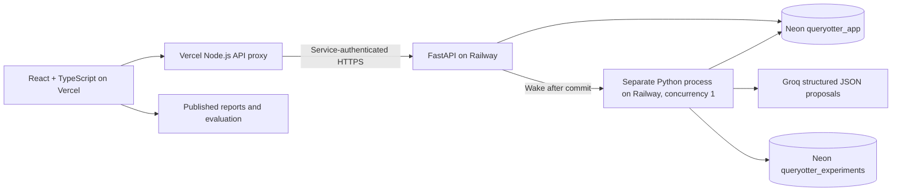

# QueryOtter

QueryOtter investigates slow PostgreSQL SELECTs using a real Groq model and a deterministic experiment executor. It reads plans, proposes rewrites or indexes, verifies results on independent fixtures, benchmarks surviving candidates, and recommends only measured improvements.

**Live app:** https://queryotter.vercel.app  
**Repository:** https://github.com/wauul/queryotter


The hosted frontend includes published measurements and a capped live demo. Cloud deployment runs the API and a separate investigation process on Railway, with durable PostgreSQL storage on Neon. Published reports remain available while the service wakes or is unavailable. Live database access is owner-authenticated and **plan-only**: metadata and EXPLAIN without ANALYZE; no records, experimental indexes or performance claims on connected databases.

**Deployment status:** Neon is provisioned and saved history is migrated. Railway is configured and tested; starting its metered service awaits owner approval. The current public app still uses the original connector until the cloud cutover is verified.

## Local setup

Requires Node 22+, Python 3.12+ and [uv](https://docs.astral.sh/uv/). PostgreSQL binaries are supplied by the locked `embedded-postgres` npm package. Docker is optional and was unavailable on the development machine.

```powershell
npm ci
uv sync --locked
npm run postgres
```

Keep that terminal running. This generates ignored `.env` secrets and starts real PostgreSQL on **127.0.0.1:55432**. In `.env`, set `MODEL_API_KEY` to a Groq key, `MODEL_BASE_URL=https://api.groq.com/openai/v1`, and `MODEL_NAME=openai/gpt-oss-120b`. A dedicated development key expires October 30, 2026; renew it in the server environment when needed. No key is shipped in the repository or frontend. `.env.example` documents configuration without credentials.

In three more terminals:

```powershell
uv run uvicorn backend.api:app --host 127.0.0.1 --port 8000 --no-access-log
uv run python -m backend.worker
npm run dev
```

Open http://127.0.0.1:5173. The Vite server injects the service token into its API proxy; it never sends that secret to the browser. Owner login uses `ADMIN_PASSWORD` from the private worker environment. Public registration is not implemented.

```powershell
uv run pytest -q
npm run build
uv run python -m scripts.evaluate
```

Evaluation makes real model calls; use the free Groq tier and its existing rate limits. It waits between supported cases and retries once on transient provider errors. Unit/integration tests do not call the model. Run evaluations with the worker idle for comparable resource conditions. Local development uses SQLite when `JOB_DATABASE_URL` is unset; the cloud configuration requires a PostgreSQL job store.

## Scope and decisions

Supported: filters, sorting, joins on supplied tables, aggregation, deterministic pagination, SELECT-only CTEs, missing indexes and ordinary column/covering index candidates. The public demo permits only 15 fixed examples. Authenticated custom queries target the synthetic `customers`, `orders`, and `items` tables. Live plan-only queries can target bounded public-schema tables using standard types.

Rejected: multiple statements, writes including data-modifying CTEs, SELECT INTO, locks, recursive CTEs, set operations, windows, volatile/unknown functions, arbitrary schema qualification and pagination without a supported unique tie-breaker. The SQL validator deliberately has a narrow allowlist. Unique ordering inference supports demo PK/FK patterns and grouped columns; it is not a general functional-dependency prover.

The loop is **inspect → explain → hypothesize → experiment → validate → benchmark → recommend**. The Groq model receives compact JSON plan nodes and relevant schema/statistics, never records or connection credentials. It chooses up to three ranked candidates in one decision call, with at most one transient retry. The executor owns all SQL validation, execution permissions, semantic comparison, benchmark calculations and recommendation selection. The agent is a bounded one-round investigator; it does not conduct unlimited exploratory model loops.

## Architecture



HTTP handlers enqueue work and return. Neon stores owner-scoped jobs, events, idempotency keys, quotas and encrypted connection URLs in the `queryotter_app` database, under schema `qot_app`. Atomic claims use `FOR UPDATE SKIP LOCKED`; a PostgreSQL advisory lock prevents overlapping Railway deployments from executing experiments concurrently. Safe cancellation checkpoints and at most two attempts handle interruption. Requests with the same owner and idempotency key return the existing job. Report export and cancellation enforce the same owner check as retrieval. Reusing a request key with changed SQL or connection is rejected: use a fresh key.

`python -m backend.cloud` supervises the API and a separate worker process in one Railway container. Committed jobs wake the worker through an interprocess event. It drains the durable queue and releases its connections while idle, allowing Railway and Neon to sleep. Worker failure terminates the container so Railway can restart and recover queued work. No local database files or volume are required in cloud mode; the local SQLite store remains a development option and migration backup.

## Dataset and isolation

Each investigation creates a random `qot_…` disposable schema with **10,000 customers, 120,000 orders and 240,000 items** (370,000 rows total), using deterministic arithmetic and seed 17. Every candidate also runs against empty tables and 300-/900-order edge fixtures with seeds 17 and 31, including NULLs, duplicate projected rows, an orphan customer, skew and boundary timestamps. See `backend/db.py` for exact seed SQL. Schemas are removed in a `finally` block; indexes are built only inside rollback transactions. On cloud startup, the worker removes abandoned schemas owned by the experiment role whose names match the exact generated prefix, while holding its global execution lock.

The experiment URL must point to a **dedicated disposable database**. On Neon, `qot_experiment_runtime` owns `queryotter_experiments`; `qot_app_runtime` owns the separate `queryotter_app` database. Neither login can connect to the other's database. Both are non-superuser roles without database/role creation, replication or RLS bypass privileges. The experiment role creates test schemas. SELECT/EXPLAIN run under `qot_reader`, a NOLOGIN, non-superuser role with SELECT grants. Standalone SELECTs also use read-only transactions; inside an index experiment transaction, restrictive role permissions protect execution while permitting the provisioning role to create disposable indexes. SQL comments are stripped and untrusted input cannot alter the system prompt. Remote database connections verify TLS certificates using the bundled CA certificates.

Timeouts: statements 3 seconds, locks 500 ms, jobs 180 seconds with cooperative checkpoints. Model HTTP calls are limited to 45 seconds, with one bounded retry. Cancellation can wait for the current statement or provider request to finish. Comparisons stream at most 20,001 rows and reject results above 20,000 rows or 4 MB. One active run per session, 10 submitted jobs/hour/session, six anonymous model runs/day globally; cached reports cost nothing. Login attempts are limited. Quotas persist across restarts.

Live connections require a non-superuser role without creation/replication/bypass privileges, public-schema CREATE or direct write grants. Remote URLs require `sslmode=verify-full`. Credentials are encrypted using Fernet with a server-held key. Metadata is restricted to the public schema and 100 columns; live statements use read-only transactions, 1.5-second statement timeouts and 200-ms lock timeouts. Inherited permissions and arbitrary custom PostgreSQL type behavior are not comprehensively audited; only trusted owner connections to sanitized replicas should be used. Live data is never copied automatically. No production index or query replacement is applied.

## Correctness and benchmark methodology

The published September 30 evaluation contains **15 fixed cases**: 12 supported and three rejected before execution. Eight supported cases produced verified improvements, two were inconclusive, and two had no justified candidate. There were **zero regressions and zero provider errors** in the final suite. Checks passed for 9/10 cases where the agent proposed candidates; the NULL trap failed an empirical check and was excluded. All eight selected recommendations passed every fixture. The deterministic baseline sometimes outperformed the agent (notably the item join); those results are retained. The evaluation took 222.16 seconds including provider pacing, used 12 model calls, and publishes per-case token counts, SQL calls, runtime and index costs. Rejected candidates are not presented as verified recommendations.

For the customer-orders case, PostgreSQL 18.4 on 120,000 orders measured **4.483 ms → 0.027 ms** median, **166.04×**, with original/candidate MAD **0.115/0.001 ms**. All four fixtures passed. The selected index took **46.85 ms** to build and used **4,898,816 bytes**:

```sql
SELECT id, customer_id, total, created_at
FROM orders
WHERE customer_id = 42
ORDER BY created_at DESC, id DESC
LIMIT 50;

-- Reviewable recommendation; never applied to production automatically.
CREATE INDEX idx_orders_customer_created_id
ON orders (customer_id, created_at DESC, id DESC);
```

The SELECT itself was retained. Seven original samples were `[4.410, 4.253, 4.588, 4.483, 4.598, 4.636, 4.238]` ms; candidate samples were `[0.031, 0.029, 0.027, 0.029, 0.027, 0.026, 0.027]` ms. The fixed deterministic baseline measured 0.026 ms in its own run. These are warm-cache measurements on this synthetic workload, not general speedup guarantees.

Independent deterministic checks compare PostgreSQL type OIDs and typed values. Without ORDER BY, rows are compared as multisets including duplicate multiplicity; with ORDER BY, sequences must match. Edge tests specifically prove that a naive NOT IN → NOT EXISTS rewrite with NULLs and a DISTINCT rewrite over duplicates fail. Sample equality is **empirical evidence**, not mathematical equivalence.

Both original and candidate states get warmups. Two warm-up rounds precede seven measured rounds; the order alternates by round, with an additional equal warmup before each measurement. Candidate indexes are rebuilt in rollback transactions. ANALYZE runs consistently after seeding. No parallel query workers. PostgreSQL JSON EXPLAIN ANALYZE provides execution time and buffer counters. Displayed SQL latency is database execution time, excluding model/network overhead. No cold-cache claim is made. Median, minimum, maximum, samples and median absolute deviation (MAD) are exported. A win must beat a margin of `max(10% original median, 3 × max(original MAD, candidate MAD), 0.05 ms)`. Noisy or tiny differences are inconclusive.

Index build latency and storage are reported separately. Index maintenance/write overhead is disclosed but not measured. Choosing the fastest observed candidate among a small set can introduce selection bias; confirm with independent representative workloads. The original and fixed index baseline are measured independently in reproducibly seeded environments. Full case results, including no gain, errors and rejected inputs, are in `public/evaluation.json`. `database_seconds` measures client time in SQL execute calls including seeding/metadata, excluding streaming fetch, connection setup and model calls. Provider pricing estimates remain unavailable rather than assuming a paid cost.

## Deployment

The web app uses Vercel Hobby with `vercel.json`, static Vite `dist` assets, and the Node.js function `api/proxy.js`. The function forwards approved requests to the Railway service; investigations run in its separate process. `CONNECTOR_URL` and sensitive `SERVICE_TOKEN` belong in Vercel's Production and Preview environments. The Groq key, database URLs, owner password, session secret and encryption key belong only in Railway's service variables. `.vercelignore` and `.dockerignore` exclude credentials and local data from deployments.

The Neon project is **queryotter**, ID `quiet-rice-58196279`, PostgreSQL 18, production branch `br-misty-truth-b1lldsfk`, in **AWS Frankfurt (`eu-central-1`)**, on the Free plan. Open its [dashboard](https://console.neon.tech/app/projects/quiet-rice-58196279/branches/br-misty-truth-b1lldsfk). The databases are `queryotter_app` and `queryotter_experiments`. The read-only `qot_live_reader` role accesses only the synthetic public fixture. Connection credentials are private and are not documented here.

Railway project **queryotter**, ID `fae90a5c-25a7-4a7d-aedb-7942bfcbae8b`, has one **api-worker** service in Amsterdam. Its [dashboard](https://railway.com/project/fae90a5c-25a7-4a7d-aedb-7942bfcbae8b) shows health, logs and resource usage. The service has one replica, a 512 MiB memory limit and 0.5 vCPU limit, with serverless sleeping enabled. Railway is on the owner's existing metered Hobby workspace; these limits reduce usage but are not a dollar cap. Neon and Vercel remain on their free plans. Sleeping services can make the first request slower; retry after a short delay if the initial wake exceeds the proxy timeout.

The container is built from `Dockerfile` and starts `backend.cloud`. Infrastructure is defined by `.railway/railway.ts`; secret variables use `preserve()` and are entered separately. Initial provisioning uses `scripts/provision_neon.py` and migration uses `scripts/migrate_job_store.py`, with private bootstrap credentials in ignored `.data` files. Migration preserves signing/encryption keys and IDs and copies jobs, events, connections and quotas. Never rotate encryption keys without migrating stored encrypted connections.

After authenticated CLI linking and private environment setup, deploy the worker:

```powershell
railway config plan
railway config apply --yes
railway up --detach --service api-worker --environment production
railway domain --service api-worker
```

Use the service's HTTPS Railway domain for `CONNECTOR_URL`. Direct API requests require the service token; `/healthz` exposes only readiness. The Vercel proxy removes caller-supplied service headers, forwards only approved routes, refuses cross-origin writes, and never redirects credentials. Deployments are manual through authenticated CLIs; automatic GitHub deployment is not connected. On Windows, the current Railway SDK may need the `_` environment variable set to the actual `railway.exe` path when planning/applying, rather than the npm PowerShell shim.

Build and deploy from this repository:

```powershell
npm run test:proxy
npm run build:web
vercel link --yes --scope wauuls-projects --project queryotter
vercel env add CONNECTOR_URL production,preview
vercel env add SERVICE_TOKEN production,preview --sensitive
vercel deploy --prod --yes
```

Run the two `env add` commands only during initial setup, entering the Railway URL and the matching service token from the private worker environment. Use `vercel env update CONNECTOR_URL production,preview` and redeploy when changing the backend URL. Never pass credentials as command-line arguments or commit them. Future updates require `railway up` for backend changes and `vercel deploy --prod --yes` for frontend/proxy changes after validation.

The previous Sites deployment remains available; its optional build is `npm run build` followed by `uv run python scripts/package-site.py`, using `.openai/hosting.json` and `hosting/worker.js`. Vercel uses `build:web` and does not package the Sites Worker.

## Troubleshooting and limits

- **Worker unavailable:** published reports still render. Allow a sleeping service to wake, then check Railway deployment health and Neon availability. No desktop processes are required after cloud cutover.
- **Groq 429:** free-tier quota exhausted. Wait for reset; the worker retries once, then reports failure without provider secrets. No paid fallback.
- **Invalid connection:** check credentials, TLS verification, port, read-only grants and supported schema size. Detailed driver errors are suppressed to avoid disclosing URLs or records.
- **Comparison rejected:** supply a smaller deterministic result or supported ordering. The app will retain the original query.
- **Restart recovery:** a running job requeues once; a second interruption fails safely. The cloud worker cleans owned abandoned experiment schemas under its global lock before recovery.
- **Owner account:** one configured owner login; anonymous sessions have isolated histories. Multi-user signup/OIDC is not implemented.
- **Metadata cache:** per-job schema snapshot only; no cross-job cache because disposable schemas are recreated. Statistics are refreshed after seeding.
- **Model budget:** at most three candidates, one model decision plus one transient retry. No iterative follow-up decision or plateau-search loop.

CI builds the frontend and Docker image, starts the Linux cloud container against disposable PostgreSQL, checks readiness and unauthenticated API rejection, and runs deterministic API/SQL/database and Vercel proxy tests. It does not consume model credits. Node and Python dependency lockfiles are committed. See the published evaluation for actual model/SQL usage and outcomes, and `tests/` for reproducible safety, semantic and operations checks.

## Verification evidence

The original authenticated live plan-only verification used a dedicated local read-only fixture: encrypted connection storage, a real Groq proposal from metadata and non-executing EXPLAIN, no record reads, no measured latency claims and no experimental indexes. Its saved connection is migrated to the Neon read-only fixture. `scripts/verify-live.py --neon` verifies it after cloud cutover; omitting that flag uses the local fixture. See `docs/live-verification.json` for the latest deployed evidence.

**49 Python tests and three Vercel proxy tests passed**; GitHub CI also passed on Linux, including the Docker startup check. Coverage includes parsing, unsafe functions/writes, NULL/duplicate/type/order traps, experiment role restoration, actual statement timeout, cancellation, persisted jobs, cross-session isolation, idempotency, encrypted-connection setup errors, CSRF and report export. PostgreSQL store tests exercise concurrent quota increments, atomic claims, one active job per owner, recovery, advisory worker locking and wake-after-commit behavior. Proxy tests cover protected headers, secure session cookies, report downloads, actual body-size limits, redirects and redacted connector failures. Production build passes TypeScript and Vite. There is a dependency deprecation warning from Starlette's TestClient/httpx combination; it does not affect test results.

The Vercel production flow was tested with real Groq/SQL work: **4.357 ms → 0.027 ms** in a fresh customer-orders investigation. Job history persisted; duplicate submission returned the same job; a separate browser session could not read, cancel or export it. Cancellation reached a persisted terminal state. Unsafe SQL was refused before execution. Owner authentication, secure session cookies, cross-origin write rejection and redacted invalid connection errors were verified. The browser rendered the published measurements with a connected worker and downloaded a valid JSON report. Full job evidence is in `docs/deployed-verification.json` (synthetic SQL and metadata only; no credentials or records).

To repeat deployed verification (uses the private owner password to avoid exhausting the public demo quota; makes one model run and one cancellable submission):

```powershell
uv run python scripts/verify-deployed.py https://queryotter.vercel.app --owner
uv run python scripts/verify-live.py https://queryotter.vercel.app --neon
```
